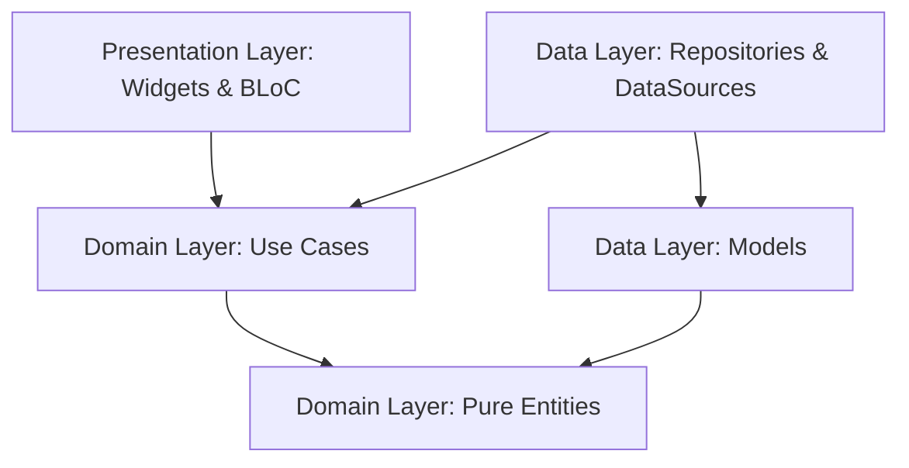

# Ad Campaign Performance Dashboard 🚀

A state-of-the-art, premium Flutter mobile application designed to analyze, track, and forecast ad campaign performance. Built with **Clean Architecture**, robust state management, and functional programming patterns, this dashboard empowers digital marketers with real-time analytics, automated anomaly detection, and predictive forecast models.

---

## 🎨 Design & Visual Excellence
* **Harmonious Palette**: Sleek dark mode UI tailored with HSL-defined custom colors and modern gradients.
* **Dynamic Visualization**: Custom-painted interactive Donut Charts for channel spend breakdown and high-fidelity Line Charts showcasing historical progress and predictive forecast projections complete with custom confidence bands.
* **Component-Driven UI**: Entirely built on reusable design tokens, premium widgets (e.g. `AppCard`, `AppText`), and smooth transitions.

---

## ⚙️ Architecture & Design Principles

The project strictly follows **Clean Architecture** patterns combined with **SOLID**, **DRY**, **KISS**, and **YAGNI** principles. By splitting the codebase into independent layers, we achieve high testability, easy maintenance, and decoupling of business rules from UI libraries.



### Architectural Slices:
1. **Domain Layer (Pure)**:
   * **Entities**: Pure business data structures free from external library dependencies (no string formatting, no database schemas).
   * **Use Cases**: Encapsulates specific application business logic.
   * **Repository Interfaces**: Defines contracts for data fetch operations.
2. **Data Layer (Implementation)**:
   * **Models**: Extends entities to provide serialization capability (`fromJson`/`toJson`) using Freezed & JSON Annotation.
   * **Data Sources**: Retrieves data via `Dio` from remote servers, with defensive type check handles.
   * **Repositories**: Implements domain interfaces, converting raw models into type-safe business entities.
3. **Presentation Layer (UI & State)**:
   * **BLoCs**: Standardizes state propagation and reactive logic with concurrent event dispatch strategies.
   * **Pages & Widgets**: Highly responsive layout slices built using Material Design tokens and adaptive components.

---

## 🏗️ Project Structure

```bash
├── Ad_Campaign_Performance_Dashboard/
        ├── lib/ 
        ├── features/
        |     ├── feature_Name/
        |     |     
        |     |     ├── presentation/ # contains ui codes and states
        |     |     |      ├── page.dart # UI page
        |     |     |      ├── widgets/ # common widget for this feature
        |     |     |          └── widget.dart 
        |     |     |      └── Bloc/ # State management solution (Bloc, Provider)
        |     |     |          ├── Bloc.dart
        |     |     |          ├── event.dart 
        |     |     |          └── state.dart
        |     |     |             
        |     |     ├── domain/
        |     |     |      ├── entities/
        |     |     |          └── entity.dart # entity connecting with usecase
        |     |     |      ├── repository/ 
        |     |     |          └── abstract_repository.dart # Abstract interface 
        |     |     |      └── usecase/ 
        |     |     |          └── usecase.dart # Usecase connecting with presentation layer
        |     |     |      
        |     |     ├── data/ 
        |     |     |      ├── data_sources/
        |     |     |         ├── remote_data_source.dart # External Api,
        |     |     |         └── local_data_source.dart # SQFlite, Hive
        |     |     |      ├── model/
        |     |     |         └── feature_model.dart # Model classes
        |     |     |      └── repository/ 
        |     |     |         └── repository_implementation.dart # Implementation of Domain Abstract layer
        |     |     └── feature_dependencies.dart    # feature Dependency Injection     
        |     └── ...
        ├── Core/
        |     ├── app_config/  
        |     |     ├── api_config.dart
        |     |     ├── auth_session.dart
        |     |     └── ...
        |     ├── di/  # Core Dependency injection 
        |     |     ├── injection.dart
        |     |     └── ...
        |     ├── environment/  # App env (dev, prod, staging) 
        |     |     ├── app_env.dart
        |     |     └── ...
        |     ├── error/   # Common app errors and exceptions
        |     |     ├── exception.dart
        |     |     ├── failures.dart
        |     |     └── ...
        |     ├── extension/        # Extension methods
        |     |     ├── string_extension.dart
        |     |     ├── date_extension.dart
        |     |     └── ...
        |     ├── logger/    # app logs
        |     |     ├── app_logger.dart
        |     |     └── ...
        |     ├── network/    # Network configuration (dio, interceptors, network endpoints)
        |     |     ├── endpoints.dart
        |     |     ├── interceptors.dart
        |     |     ├── api_client.dart
        |     |     └── ...
        |     ├── route/      # App Navigation
        |     |     ├── app_router.dart
        |     |     ├── routes.dart
        |     |     └── ...
        |     ├── services/      # App local services -> Notification Service
        |     |     ├── local_services.dart
        |     |     └── ...
        |     ├── theme/      # App theme and colors
        |     |     ├── colors.dart
        |     |     ├── theme.dart
        |     |     └── ...
        |     ├── utils/    # utilities
        |     |     ├── typography.dart
        |     |     ├── show_snackbar.dart
        |     |     └── ...
        |     ├── widgets/      # Common reuseable widgets across app
        |     |     ├── loader.dart
        |     |     ├── primary_button.dart
        |     |     └── ...
        |     └── ...  
        ├── my_app.dart    # Application entry point
        └── main_dev.dart   # Dart entry point dev
        └── main_prod.dart   # Dart entry point prod
```


---

## 🛠️ Technology Stack & Tooling

* **State Management**: `flutter_bloc` & `freezed` for robust, unidirectional, type-safe state flows.
* **Networking & Parsing**: `dio` for network requests with full custom interceptors paired with defensive `ErrorHandler` configurations.
* **Functional Programming**: `fpdart`'s monadic `Either` type to manage robust operational flows and network failures cleanly.
* **Navigation**: `go_router` supporting seamless navigation hooks.
* **Visuals & Charts**: `fl_chart` leveraging native rendering pipelines to paint gorgeous historical trends and confidence band forecasts.
* **Code Generation**: `freezed`, `json_serializable`, and `build_runner` for quick model serialization and immutable code safety.

---

## 🚀 Getting Started

### Prerequisites
* Flutter SDK (Version `>= 3.11.1`)
* Dart SDK

### Installation & Run

1. **Clone the repository**:
   ```bash
   git clone <repository_url>
   cd ad_campaign_performance_dashboard
   ```

2. **Install project dependencies**:
   ```bash
   flutter pub get
   ```

3. **Run Code Generation** (Freezed and JSON Serializers):
   ```bash
   dart run build_runner build --delete-conflicting-outputs
   ```

4. **Launch the application**:
   * For **Development Environment**:
     ```bash
     flutter run -t lib/main_dev.dart
     ```
   * For **Production Environment**:
     ```bash
     flutter run -t lib/main_prod.dart
     ```

---

## 📝 Best Practices & Refactoring Achievements

Over the development iterations, several key enhancements have been integrated:
* **Decoupled Business & UI Layers**: String formatting (`toStringAsFixed(1)`) was removed from business Entities and relocated to presentation widgets to ensure pure domain models.
* **Type-Safe API Parsing via Enums**: Replaced dynamic magic strings with type-safe enums (`AdChannel`, `CampaignStatus`, `CampaignObjective`, `ForecastTrend`) equipped with native conditional utilities to eliminate runtime errors.
* **Concurrent Event Orchestration**: Decoupled chained BLoC dependencies. Independent streams (like Forecast calculations and live history telemetry) are now requested concurrently directly from context providers, speeding up initial screen loading times.
* **Enhanced Visual Integrity**: Handcrafted a gorgeous forecast chart rendering actual projection lines and shaded probability variance bands safely aligned using flex metrics.
